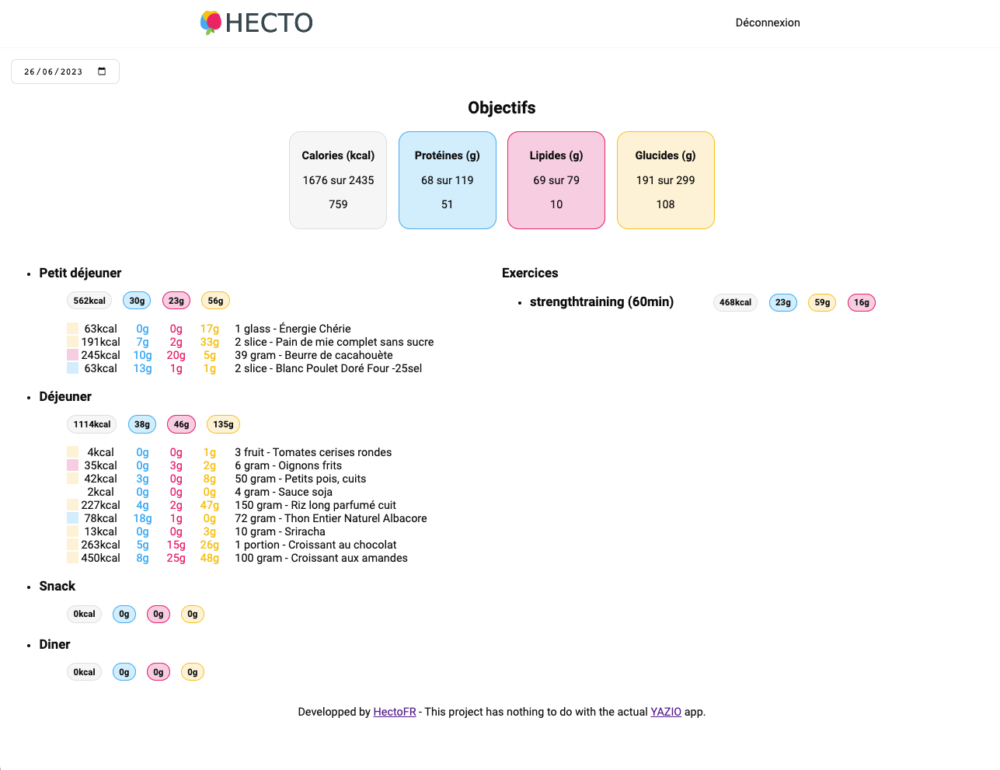

`Hecto` is a web client for the well known calorie and nutrition tracking app YAZIO.

# Preview



# Getting Started

## 1. Clone this repository

```bash
git clone git@github.com:HectoFR/Hecto.git
```

## 2. Install dependencies

```bash
npm install
```

## 4. Create `.env.local`

You need to create a file called `.env.local` in the project root. This file has to contain the following one environment variables:

```.env
VUE_APP_PROXY_URL=https://cors-anywhere.herokuapp.com/corsdemo
```

Proxy is needed because of CORS blocking frontend request. If you have an other solution, feel free to tell me :)

## 4. Run the development server

You can start the server using this command:

```bash
npm run serve
```

Go to [http://localhost:8080](http://localhost:8080) to see the result.

# Disclaimer

This project has nothing to do with the [YAZIO](https://www.yazio.com/en) app.
If anyone from YAZIO sees this and wants me to stop the project, please tell me.